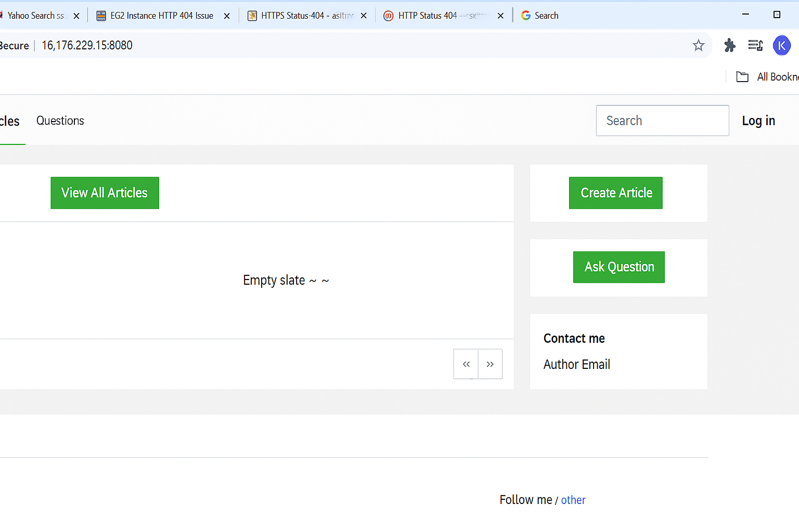
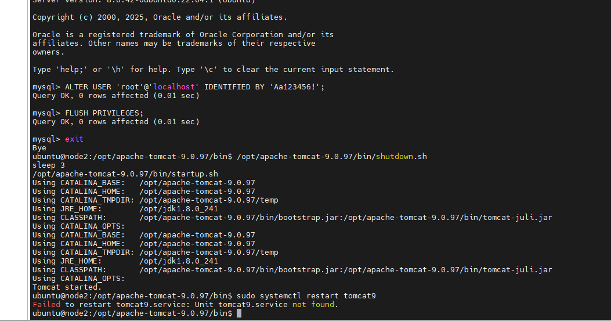
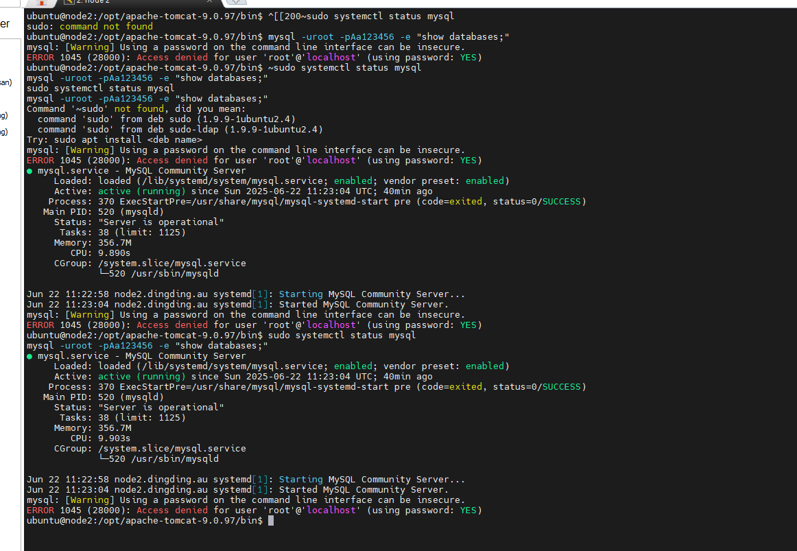
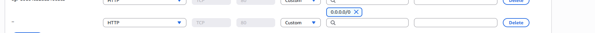
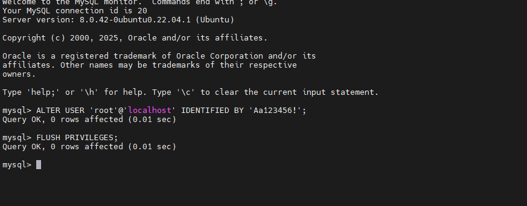
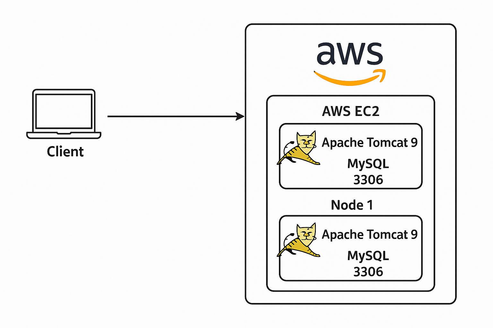
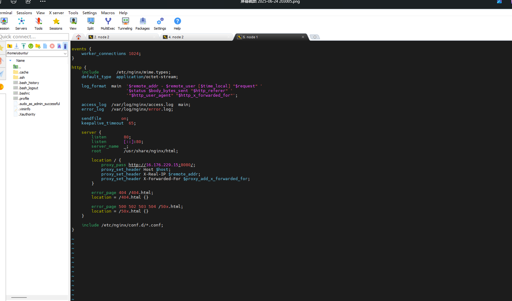
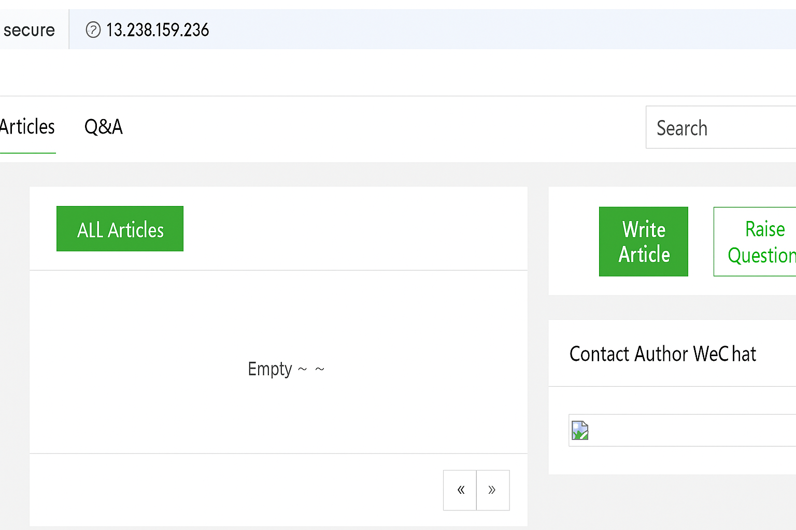
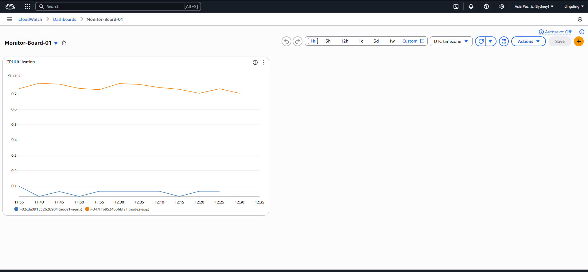

# Java Web Application Deployment on AWS

The `ROOT.war` package was provided as part of a DevOps training project. I was fully responsible for independently deploying, configuring, and troubleshooting the application on AWS.

---

## 🚀 Deployment Stack

- **Cloud**: AWS EC2 (Ubuntu 20.04)
- **App Server**: Apache Tomcat 9
- **Database**: MySQL 8
- **WAR File**: `ROOT.war` (given, not developed by me)
- The web app was successfully deployed and tested on two AWS EC2 instances (Node 1 and Node 2). For security reasons, public IP addresses are not included.

---

## 🧠 Skills Practiced

- SSH remote login and Ubuntu system management  
- MySQL root password reset and connection testing  
- Apache Tomcat installation and configuration  
- WAR deployment and resolving 404 errors  
- AWS EC2 security group setup for port 8080  
- Nginx installation and multi-instance deployment  
- System status display via custom alarm endpoint  

---

## 📋 Deployment Steps

1. Launched EC2 Ubuntu instances (Node 1 and Node 2)  
2. Installed Java, MySQL, and Tomcat on Node 1  
3. Uploaded and deployed `ROOT.war` to `/webapps`  
4. Opened port 8080 in AWS security group  
5. Restarted Tomcat and verified service  
6. Installed and verified Nginx on Node 2 (port 80)  
7. Tested connectivity with translated web UI and alarm endpoint  

---

## 🗼 Key Screenshots

✅ **1. MySQL Root Password Reset**  
This screenshot shows the process of resetting the MySQL root password using the `ALTER USER` command followed by `FLUSH PRIVILEGES;`.  

✅ **2. WAR Upload to Tomcat**  
This step shows the `ROOT.war` file being uploaded to the `webapps` directory of Tomcat to replace the default root application.  

✅ **3. EC2 Security Group Port Configuration**  
Port 8080 (TCP) was opened to `0.0.0.0/0` via AWS security group to allow external access.  

✅ **4. Tomcat Started Successfully**  
Tomcat was restarted to deploy the WAR file, confirmed by the console output.  

✅ **5. Tomcat Login Page Display**  
Successfully loaded the web app on browser using EC2 public IP and port 8080.  

✅ **6. Architecture Diagram**  
This diagram outlines the complete setup:
- EC2 instance with Apache Tomcat + MySQL  
- Deployed WAR application  
- Port 8080 open for HTTP access  
- Separate EC2 instance running Nginx  
- End-user accesses via browser  

✅ **7. Translated Blogging Platform Web Interface**  
English-translated UI for the blogging platform showing an empty post list and Q&A tabs.  

✅ **8. Nginx Welcome Page on Node 2**  
Nginx default page confirms HTTP service running on second EC2 instance.  

✅ **9. Alarm Status Page (Custom Endpoint Test)**  
Simulated alarm endpoint was tested for accessibility and frontend status display.  

---

##📁 Repository Structure

java-aws-deployment/
├── screenshots/ # All screenshots used in this README
│ ├── 1_mysql_login.png
│ ├── 2_upload_root_war.png
│ ├── 3_ec2_port_8080.png
│ ├── 4_tomcat_started.png
│ ├── 5_login_page.png
│ ├── 6_architecture_Diagram.png
│ ├── 7_nginx1.png
│ ├── 8_nginx2.png
│ └── 9_alarm.png

├── ROOT.war # The Java WAR file
└── README.md # Project explanation (this file)

复制
编辑

## 📌 Notes

This project demonstrates my ability to independently deploy and troubleshoot cloud-based web applications. It is intended to showcase foundational DevOps and IT Support skills applicable to entry-level technical roles.

